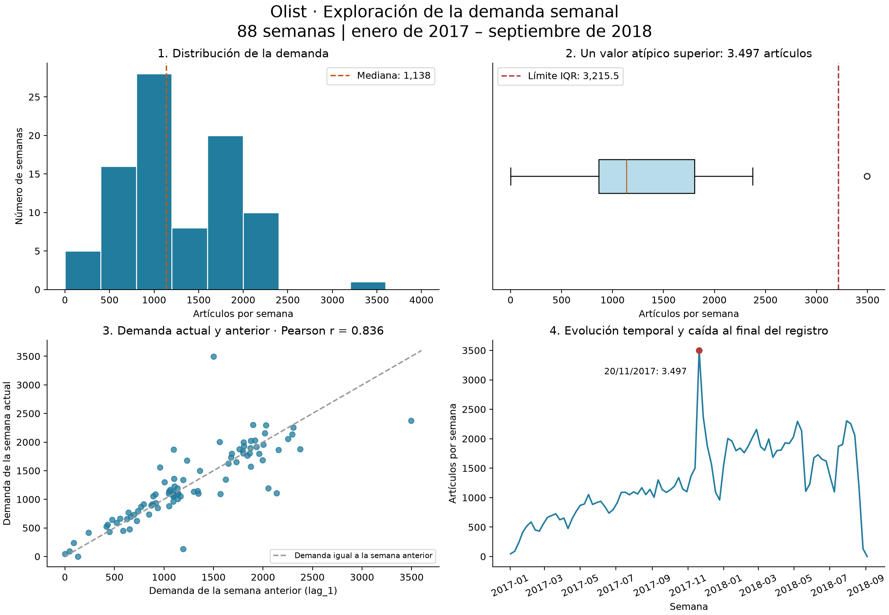

# Análisis exploratorio del proyecto de predicción semanal de demanda

Las cifras se calcularon directamente con los CSV locales. Se responde sobre el conjunto preparado para el modelo y se distingue de las tablas originales.

## 1. ¿Qué datos tenemos?

La fuente del proyecto son las tablas de comercio electrónico **Olist** presentes en la carpeta. `tarea_takeshi.py` une `olist_orders_dataset.csv` (99.441 pedidos, 8 variables) con `olist_order_items_dataset.csv` (112.650 artículos, 7 variables) mediante `order_id`. Cuenta las filas de artículos por semana y construye `demanda_predictiva_takeshi.csv`.

El conjunto preparado contiene **88 registros semanales y 13 variables**, desde el **02/01/2017 hasta el 03/09/2018**. Suma **112,280 artículos registrados**. La variable objetivo es `demanda_real`.

| Tipo principal | Variables | Cantidad y observación |
| --- | --- | --- |
| Fecha | semana | 1; se convierte desde texto al leer el CSV |
| Enteros | demanda_real, mes, semana_del_anio, trimestre, quiebre_stock | 5; quiebre_stock es binaria |
| Decimales | lag_1, lag_2, lag_3, lag_4, promedio_movil_4, promedio_movil_8, demanda_predicha | 7; los rezagos representan conteos |

**Alcance:** se agregan artículos de 3,095 vendedores de toda la base; no se filtra una sola tienda. Son artículos registrados en pedidos, una aproximación a la demanda, y no una medición de toda la demanda potencial ni de ventas perdidas. El proceso tampoco filtra por estado: incluye 542 filas de artículos de pedidos cancelados.

## 2. ¿Hay datos faltantes?

**El archivo preparado tiene cero valores faltantes en sus 13 variables.** Las tablas originales sí contienen faltantes:

| Archivo | Variable | Faltantes |
| --- | --- | --- |
| olist_order_reviews_dataset.csv | review_comment_title | 87656 |
| olist_order_reviews_dataset.csv | review_comment_message | 58247 |
| olist_orders_dataset.csv | order_approved_at | 160 |
| olist_orders_dataset.csv | order_delivered_carrier_date | 1783 |
| olist_orders_dataset.csv | order_delivered_customer_date | 2965 |
| olist_products_dataset.csv | product_category_name | 610 |
| olist_products_dataset.csv | product_name_lenght | 610 |
| olist_products_dataset.csv | product_description_lenght | 610 |
| olist_products_dataset.csv | product_photos_qty | 610 |
| olist_products_dataset.csv | product_weight_g | 2 |
| olist_products_dataset.csv | product_length_cm | 2 |
| olist_products_dataset.csv | product_height_cm | 2 |
| olist_products_dataset.csv | product_width_cm | 2 |

Las demás tablas no tienen celdas nulas detectadas por `pandas.isna()`. Los faltantes de pedidos están en fechas de aprobación o entrega; el proceso usa `order_purchase_timestamp`, que está completo. Las tablas de reseñas y productos no intervienen en este cálculo de demanda. Por eso no se imputaron esas columnas: no son necesarias para esta transformación. No se comprobó aquí la existencia de códigos especiales que pudieran representar faltantes.

Al crear los rezagos aparecen 1, 2, 3 y 4 nulos en `lag_1` a `lag_4`. Los promedios móviles de 4 y 8 observaciones generan 3 y 7 nulos. `demanda_predicha`, copia del promedio de 4 observaciones, también tiene 3 nulos antes de limpiar. Se aplica `dropna()`: se eliminan **7 filas iniciales**, pasando de **95 a 88 semanas**. Son filas que todavía no tienen suficiente historia, por lo que no se inventan valores para completarlas.

Los scripts posteriores recalculan promedios con `shift(1).rolling(...)` para usar solo el pasado; esto descarta otras 8 filas iniciales del archivo preparado y deja 80 semanas para modelar. Además, en la agregación original hay 11 semanas del calendario sin filas antes de 2017: el script las omite, por lo que los primeros rezagos pueden referirse a la observación anterior y no a la semana calendario anterior. Las 88 semanas del CSV final sí son consecutivas. Es necesario revisar el período inicial antes de interpretar esos primeros rezagos.

## 3. ¿Existen valores atípicos?

Se aplicó la **regla de 1,5 veces el rango intercuartílico (IQR)** a `demanda_real`, sobre las 88 semanas, y se representó con un diagrama de caja:

- Primer cuartil: **864.25**; tercer cuartil: **1804.75**.
- IQR = Q3 − Q1 = **940.50**.
- Límites: **-546.50** y **3215.50 artículos**.
- Se detecta **1 semana atípica**: **20/11/2017, con 3.497 artículos**.

El pico equivale a **3.07 veces la mediana**. Es un valor observado que requiere revisión; el criterio estadístico no demuestra que sea un error ni explica su causa. Se conserva, porque un pico real puede ser relevante para abastecimiento. También deben revisarse las últimas semanas (132 y 1 artículos): no son atípicas según este IQR, pero podrían reflejar cobertura incompleta del final del conjunto. No debe concluirse automáticamente que el negocio dejó de vender.

## 4. ¿Cómo se distribuyen los datos?

El histograma muestra una demanda heterogénea: **mínimo 1, máximo 3497, media 1275.91 y mediana 1138 artículos por semana**. El 50% central se sitúa entre **864.25 y 1804.75 artículos**. La asimetría muestral es **0.36**, ligeramente positiva, con una cola hacia valores altos y un pico extremo.

El histograma reúne períodos diferentes: la serie temporal muestra un crecimiento general durante buena parte del período y una caída al final. Por tanto, esta distribución no debe interpretarse como una demanda estable en el tiempo ni permite afirmar por sí sola una distribución normal.

## 5. ¿Qué relaciones existen entre variables?

El gráfico de dispersión relaciona la demanda de la semana anterior (`lag_1`) con la demanda actual:

| Relación con demanda_real | Pearson r |
| --- | --- |
| lag_1 | 0.836 |
| lag_2 | 0.667 |
| lag_3 | 0.546 |
| lag_4 | 0.515 |

Se observa una **relación positiva fuerte con `lag_1` (r = 0.836)**: las semanas de mayor demanda suelen seguir a semanas de demanda alta. Esto respalda el uso de la historia reciente como referencia inicial.

**Limitaciones:** la correlación no implica causalidad ni garantiza buen pronóstico. Son observaciones temporales dependientes y parte de la relación puede deberse a la tendencia compartida. Al correlacionar los cambios semanales de ambas series, el coeficiente baja a **0.018**; la asociación en niveles no se reproduce en los cambios. Se necesitan evaluaciones que respeten el orden temporal.

Además, los `promedio_movil_4`, `promedio_movil_8` y `demanda_predicha` originales incluyen la demanda de la semana actual. Usarlos para pronosticar esa misma semana produciría fuga de información. Los scripts `02` a `05` corrigen los promedios usando `shift(1)`; por eso aquí se destaca la relación con `lag_1`.

## 6. Hallazgo interesante

**La reducción de subestimaciones en los resultados guardados aparece al agregar un margen de seguridad del 8%, con un aumento del error de pronóstico.** En las 40 semanas del backtesting existente:

| Modelo | WAPE | Semanas subestimadas | Tasa de subestimación |
| --- | --- | --- | --- |
| Linea Base | 15.88% | 18 | 45.00% |
| Random Forest | 20.00% | 18 | 45.00% |
| Random Forest Ajustado 1.08 | 22.87% | 10 | 25.00% |

El Random Forest sin ajuste tiene las mismas 18 semanas subestimadas que la línea base. Con el factor 1,08, pasan a 10: son **8 semanas menos**, una reducción relativa del **44,44%**, y la tasa baja **20 puntos porcentuales**. El WAPE, que mide el error absoluto total respecto al volumen real, sube aproximadamente **7 puntos porcentuales** frente a la línea base.

Para el negocio, esto permite discutir cuánto inventario adicional conviene mantener frente al riesgo de quedarse corto. El modelo ajustado reduce subestimaciones, pero no es el más preciso. Para decidir si conviene económicamente faltan costos de almacenamiento, faltantes y márgenes. Estos resultados proceden de los CSV del proyecto, no de un reentrenamiento en este análisis ni de una validación externa nueva.

**Interpretación de la métrica:** el proyecto llama `quiebre_stock` a `demanda_real > predicción`. Es una señal simulada de riesgo de faltante si se abasteciera exactamente esa cantidad; no prueba quiebres reales porque no hay inventario disponible ni ventas perdidas observadas.

## Gráficos

[Descargar gráficos en PDF](graficos_eda.pdf).

## Inventario completo de archivos de datos

| Archivo | Registros | Variables |
| --- | --- | --- |
| demanda_predictiva_takeshi.csv | 88 | 13 |
| olist_customers_dataset.csv | 99441 | 5 |
| olist_geolocation_dataset.csv | 1000163 | 5 |
| olist_order_items_dataset.csv | 112650 | 7 |
| olist_order_payments_dataset.csv | 103886 | 5 |
| olist_order_reviews_dataset.csv | 99224 | 7 |
| olist_orders_dataset.csv | 99441 | 8 |
| olist_products_dataset.csv | 32951 | 9 |
| olist_sellers_dataset.csv | 3095 | 4 |
| product_category_name_translation.csv | 71 | 2 |

Las tablas tienen unidades de observación diferentes; no se deben sumar sus registros como si fueran una sola muestra independiente.

## Reproducibilidad

Ejecutar `python analizar_eda.py` desde un entorno con pandas, numpy y matplotlib. El análisis verifica que la demanda, los rezagos y los promedios del CSV preparado coincidan con su reconstrucción desde pedidos y artículos. No modifica los datos originales ni los modelos. Los resultados de negocio se leen de `resultados/resumen_backtesting_jesus.csv` y `resultados/backtesting_semanal_jesus.csv`.
